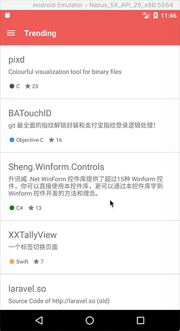

# github-explorer-react-native

This is a demo React Native app for exploring trending and most popular GitHub repositories.

Features:
- iOS and Android builds
- Relay Modern integration with GitHub GraphQL API
- React Navigation with platform specific UI idioms
- UI Automation testing with Appium

 

## Getting Started
1. Complete the React Native Getting Started guide for **iOS** and **Android**:
  - <http://facebook.github.io/react-native/docs/getting-started.html>
2. Install `yarn`. This is an optional step, you can substitute `yarn` for `npm` in the instructions that follow.
  - <https://yarnpkg.com/en/docs/install>
3. Generate an OAuth token to access the GitHub GraphQL API
  - <https://developer.github.com/early-access/graphql/guides/accessing-graphql/#generating-an-oauth-token>
4. Clone repo and install dependencies:
```
git clone https://github.com/johnwakley/github-explorer-react-native && cd github-explorer-react-native
yarn install
```
5. In the `.env` and `.env.production` files located at the root of the project, substitute text, `REPLACE_WITH_YOUR_ACCESS_TOKEN`, with the OAuth token created in step 3.
6. From the project root,
- Run the app on the iOS simulator:
  - `react-native run-ios`
- For the Android build, first, launch the emulator configured in Step 1, then run: 
  - `react-native run-android`

## Running Unit Tests
```
yarn test
```
Flow static analysis and JS Standard linting are performed before unit and snapshot tests are run.

## Running Integration Tests
[Appium](http://appium.io/) is used to drive automated UI tests for the iOS and Android builds.

### Getting Started
1. Install Appium:
```
npm install -g appium  # get appium
npm install wd         # get appium clien
```

2. The appium tests are written in python and use the python appium client library, which also needs to be installed:
```
pip install Appium-Python-Client
pip install pytest
```

3. Ensure this script: `e2e/appium_bootstrap.sh`, has execute permissions. It does the following:
- Creates a release Android app build
- Starts the Android emulator. The script is currently configured to start the emulator named: `Nexus_5X_API_25_x86`. Replace, if neccessary, with the name of the emulator you created in the React Native Getting Started guide
- Starts the Appium server
- Runs the Android UI Automator tests defined in `e2e/android_tests.py`
- Creates an iOS build using Fastlane
- Runs the iOS UI Automation tests defined in `e2e/ios_tests.py`
- Reports test results
- Completes by stopping the Appium server and device emulator and simulators.

4. Before running the appium tests, you will need to generate a keystore file that is used to create a signed APK. Instructions can be found here: [Generating Signed APK](http://facebook.github.io/react-native/docs/signed-apk-android.html)
  - Replace the following section of `android/app/build.gradle`, with the details of your own keystore:
```
storeFile file("github-explorer.keystore")
storePassword getPassword("github-explorer-apk-keystore")
keyAlias "github-explorer-key"
keyPassword getPassword("github-explorer-apk-key")
```

5. Finally, you can now run the appium tests:
```
yarn test:system
```

## Further Reading
To learn more about the libraries used in this project, check out these links:

- [React Native](http://facebook.github.io/react-native/)
- [GraphQL](http://graphql.org/)
- [Relay](https://facebook.github.io/relay/)
- [GitHub GraphQL API](https://developer.github.com/early-access/graphql/)
- [React Navigation](https://reactnavigation.org/)
- [Appium](http://appium.io/)
